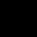
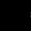

<!-- Generated by bin/gen-gif-preview.sh. Edit the descriptions here;
     everything else is rewritten from the files on the next run. -->

# GIF preview

Every animation in `config/gifs/`, which is what `bin/provision.sh` puts on the
panel and `bin/gen-presets.sh` turns into presets. 6 of them, 543 KB in total.

All of them are 64×64, the panel's own size: WLED clips anything larger and
scales smaller ones up by whole numbers only.

Frame counts are what is *stored* — runs of identical frames are merged with
their delays summed, so the duration is the number that matters. The commands
run from `gfx/`; `gfx/generate-all.sh <target>` runs one from anywhere, and
`gfx/generate-all.sh` rebuilds whatever is stale.

Each one is shown twice: **as generated** on the left, and **behind the mask**
on the right, where the 670 pixels `config/2d-gaps.json` switches off are
painted `#c0c0c0` — what the logo-shaped cut-out leaves visible. The masked
copy carries 3px of the same colour around it, corners rounded 2px, so it
reads as a panel behind a mask rather than as a second animation. Those copies
live in `docs/masked/` and are rewritten by this script.

## astryx-assemble+45.gif


The word stands at 45°, which also makes it bigger: on the diagonal it has the
panel's diagonal to fill, so it comes out 76×14 and the letters gain a fifth in
height.

`77 frames · 5.0 s · 94.0 KB · preset 1`

```sh
python3 retime.py -q -t 5 ../config/gifs/astryx-assemble+45.gif
```

## astryx-assemble-45.gif




The mirror of the one above, tilted the other way. The two cut together well
back to back.

`74 frames · 5.0 s · 88.2 KB · preset 2`

```sh
python3 retime.py -q -t 5 ../config/gifs/astryx-assemble-45.gif
```

## astryx-assemble.gif


Flat: the word lies across the panel, 64×12, letters about 12 px tall.

`75 frames · 5.0 s · 78.9 KB · preset 3`

```sh
python3 retime.py -q -t 5 ../config/gifs/astryx-assemble.gif
```

## astryx-inout.gif


The mark is held, then its outline steps inward: it thins, comes apart into its
four lobes, and they dwindle to nothing — then the same run plays backwards and
the lobes swell and close up into the mark again. 14.06 px each way, measured
rather than guessed: the script bisects for the first distance that leaves the
panel empty. Neither turn draws a frame twice, so the loop has no stutter at the
empty panel or at the hold.

`98 frames · 5.0 s · 72.4 KB · preset 4`

```sh
python3 retime.py -q -t 5 ../config/gifs/astryx-inout.gif
```

## astryx-word-c.gif


The same word on the surface of a drum turning towards you, with the drum's axis
turned 45° as well: the surface now angles away towards the top-left and
bottom-right corners, so that is where columns bunch up and dim, and they run
fastest along the other diagonal. Turning the axis puts the drum across the
panel's diagonal, which makes its arc — and its frame count — the longest of the
six, so this one runs ten seconds where the rest run five.

`194 frames · 10.0 s · 112.3 KB · preset 5`

```sh
python3 retime.py -q -t 10 ../config/gifs/astryx-word-c.gif
```

## astryx-word.gif




The wordmark crosses the panel on the diagonal: it enters at the bottom-right
corner, passes through the middle, and leaves at the top-left before starting
again — a flat marquee, no wrap-around. The whole marquee is turned 45°, the
word and its path together, which is why it is rendered on a 92×92 square and
the panel cut out of the middle.

`156 frames · 5.0 s · 97.1 KB · preset 6`

```sh
python3 retime.py -q -t 5 ../config/gifs/astryx-word.gif
```

---

## How they play

`bin/gen-presets.sh` gives each GIF an Image-effect preset, numbered in the
order above, and collects them into the "All GIFs" playlist as preset 7 — 10
seconds each.

That playlist is the boot preset (`def.ps` in `config/cfg.json`), so it is what
the panel comes up playing.

Add a GIF by writing one into `config/gifs/` — no larger than the panel, name
of 32 characters or fewer including `.gif` — then re-run `bin/gen-presets.sh`,
this script, and `bin/provision.sh <board-ip>`.

More generators sit in `gfx/` unwired from the build; see *Extra animations*
in `README.md`. Running one writes straight into `config/gifs/`, so it turns
up here on the next pass.
